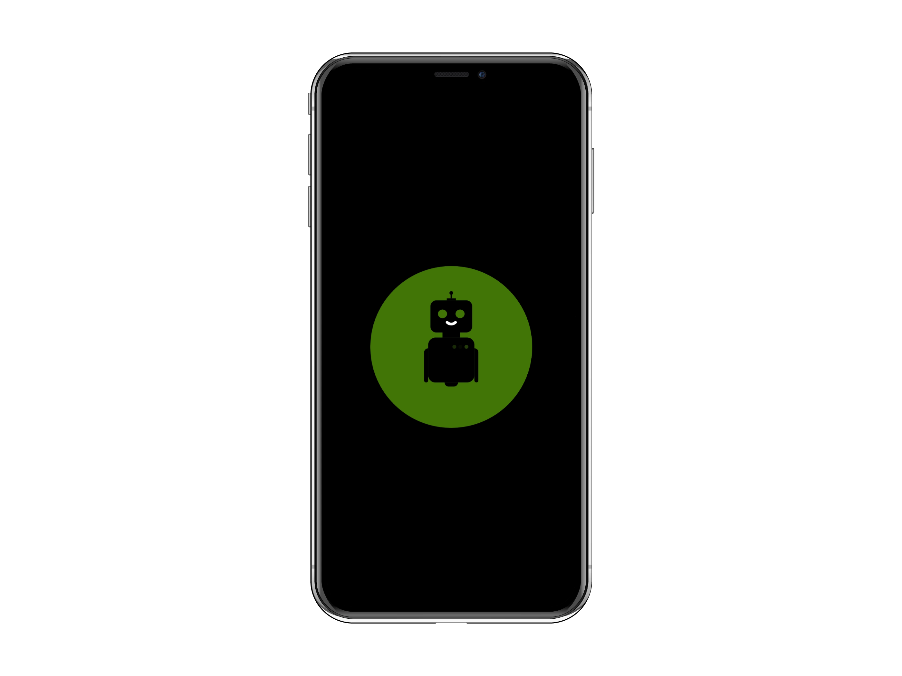
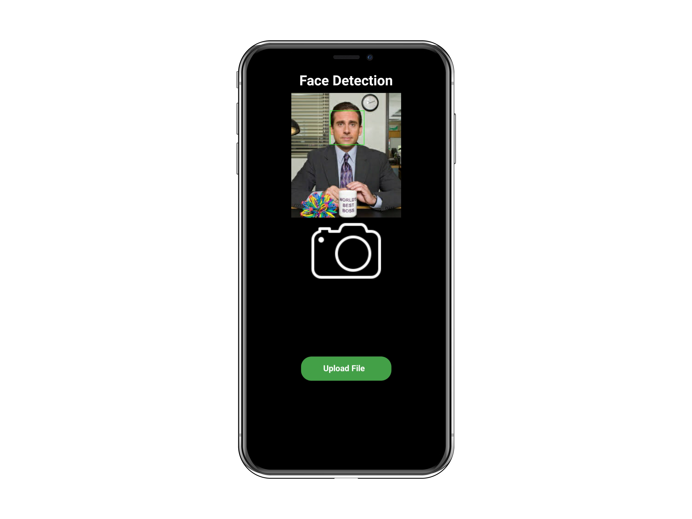

# FaceDetectionApp
-  Android app that can detect faces in an image using OpenCV
-  PyhtonScript tested and works on pycharm 
-  RetrofitAPI is used for backend in the app
-  FlaskAPI is used to run the server

## Screens

### How to Run 

- Simply clone the project onto your pc and then once the project is open 
- Change the "IP ADDRESS" to your "PC IP ADDRESS"

- Then run the app 

(Build on Android 10)
